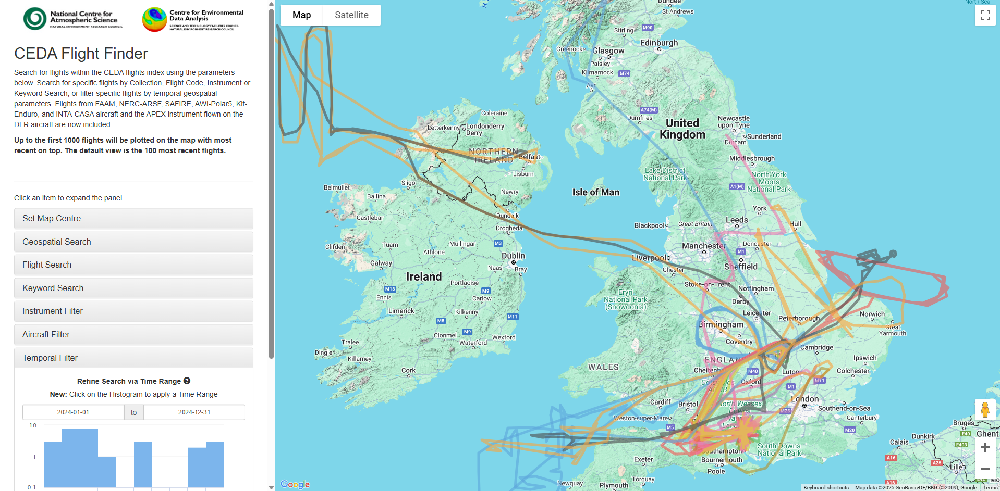

.. Flight-pipeline documentation master file, created by
   sphinx-quickstart on Wed Mar  5 15:23:55 2025.
   You can adapt this file completely to your liking, but it should at least
   contain the root `toctree` directive.

Flight-pipeline documentation
=============================

The CEDA Flight Finder tool allows searching for flights within the CEDA flights index using based on different paramenter parameters. Search for specific flights by Collection, Flight Code, Instrument or Keyword Search, or filter specific flights by temporal geospatial parameters. Flights from FAAM, NERC-ARSF, SAFIRE, AWI-Polar5, Kit-Enduro, and INTA-CASA aircraft and the APEX instrument flown on the DLR aircraft are now included.
Up to the first 1000 flights will be plotted on the map with most recent on top. The default view is the 100 most recent flights.

`The CEDA Flight Finder tool can be accessed here <https://flight-finder.ceda.ac.uk/>`_

Created March 2023

.. raw:: html

     

.. toctree::
   :maxdepth: 2
   :caption: Contents:

   Documentation <core/doc>
   Command Line Tool <core/cli>

Repository for python code to concatenate data sources and construct new flight records for CEDA flight-finder

Objectives
----------
  - Mechanism for uploading new flights to stac index
  - Use ES Client to determine array of ids that currently exists in the index
  - Push new records that are not currently in the index
  - Remove or archive pushed records on local system

Installation
------------
  - Clone the repository from github
  - Install requirements into a local virtual environment:
     - ``python -m venv local``
     - ``source local/bin/activate``
     - ``pip install -r requirements.txt``
  - Configure dirconfig with relative paths

Running the program
-------------------

**1. Use stac_template to write new records**
Follow the STAC template json file to create new flight records (more details further down)

**2. Configure dirconfig file**
Add on lines 2 and 4 the directory paths to where your new flights to push are stored, and where the pushed flights should go once they have been uploaded to the index (store them or write DELETE to remove them from the local system)

**3. Push New Flights**
Run with command ``python flight_update.py add`` with a filled in dirconfig file to push new records to the index

Update Existing Flights
-----------------------
Note: In case of repair or adjustment to existing records, the individual records can be updated in place.

Run with command ``python flight_update.py update <pyfile>``, where *pyfile* is a python file containing an *update* function that can be applied to each record in elasticsearch.

STAC Template
-------------
From the template, the following should be filled in:
 - id (fnum/pcode * date)
 - es_id (random string of ASCII characters to generate one of 9 colours in flight finder)
 - description_path
 - collection
 - geometry.display.coordinates
 - geometry.display.type (if coordinates are not MultiLineString)
 - properties:
    - data_format
    - start_datetime
    - end_datetime
    - flight_num (if applicable)
    - pcode (if applicable)
    - aircraft
    - variables
    - location
    - platform
    - instruments
    - pi

Geometries Development
======================

Correct Version of mapping that exists in the arsf index

.. code-block:: json-object
      
   "spatial": {
      "properties": {
         "geometries": {
            "properties": {
               "display": {
                  "properties": {
                     "coordinates": {
                        "type": "double",
                        "index": false
                     },
                     "type": {
                        "type": "text",
                        "fields": {
                           "keyword": {
                              "type": "keyword",
                              "ignore_above": 256
                           }
                        }
                     }
                  }
               },
               "full_search": {
                  "type": "geo_shape"
               },
               "search": {
                  "type": "geo_shape"
               }
            }
         }
      }
   }

Incorrect version currently in ``stac-flightfinder-items``

.. code-block:: json-object

   "geometry" : {
      "properties" : {
         "display" : {
            "properties" : {
            "coordinates" : {
               "type" : "float"
            },
            "type" : {
               "type" : "text",
               "fields" : {
                  "keyword" : {
                  "type" : "keyword",
                  "ignore_above" : 256
                  }
               }
            }
         },
         "geometries" : {
            "properties" : {
            "display" : {
               "properties" : {
                  "coordinates" : {
                  "type" : "float"
                  },
                  "type" : {
                  "type" : "text",
                  "fields" : {
                     "keyword" : {
                        "type" : "keyword",
                        "ignore_above" : 256
                     }
                  }
               }
            },
            "search" : {
               "properties" : {
                  "coordinates" : {
                  "type" : "float"
                  },
                  "type" : {
                  "type" : "text",
                  "fields" : {
                     "keyword" : {
                        "type" : "keyword",
                        "ignore_above" : 256
                     }
                  }
               }
            }
         },
         "search" : {
            "properties" : {
            "coordinates" : {
               "type" : "float"
            },
            "type" : {
               "type" : "text",
               "fields" : {
                  "keyword" : {
                  "type" : "keyword",
                  "ignore_above" : 256
                  }
               }
            }
         }
      }
   }

Ammendments:
------------

 - Remove **geometries** subfield.
 - Remove all subfields of **search** and just add ``"type":"geo_shape"``.
 - Add **full_search** sub_field with ``"type":"geo_shape"``.

.. image:: _images/ceda.png
   :width: 300
   :alt: CEDA Logo